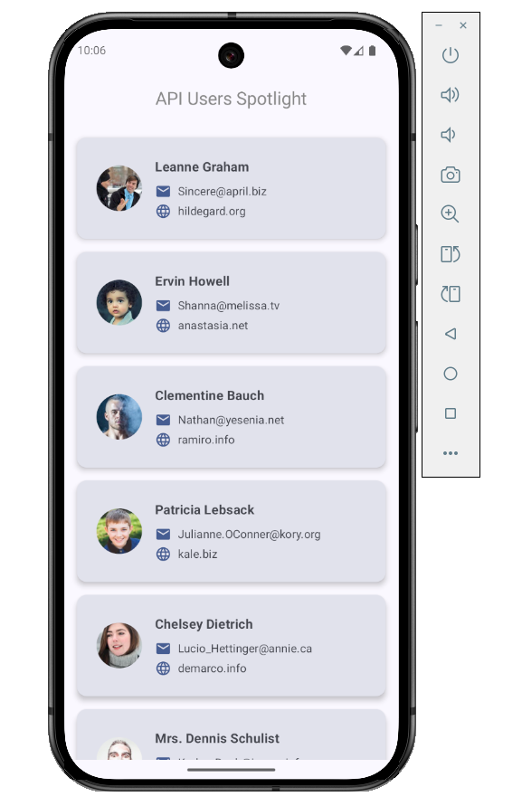

# UserInfo

**Android Jetpack Compose app showcasing a Material 3 UI that fetches and displays users from the JSONPlaceholder API.**

**Türkçe:**  
JSONPlaceholder API’sinden kullanıcı verilerini çekip Material 3 tasarımıyla listeleyen Android Jetpack Compose uygulaması.

## Features

- Fetches user data from the [JSONPlaceholder Users endpoint](https://jsonplaceholder.typicode.com/users).  
- Displays users in a clean, Material 3 Card layout.  
- Shows a loading indicator while fetching data.  
- Center-aligned TopAppBar with menu and search icons (placeholders).  
- Syncs status bar color with the app theme.

## Screenshots



<!--  
If you placed the image in a `docs/` folder instead, use:

-->

## Setup

1. Clone the repository:  
   ```bash
   git clone https://github.com/AbdulkadirEkrem/User-Information-API.git
2. Open the project in Android Studio.

3. Let Gradle sync and build the project.

4. Run the app on an emulator or physical device.

## Dependencies

- Kotlin
- Jetpack Compose
- Material 3
- Retrofit 2 & Gson

## License

- MIT © Abdulkadir Ekrem


